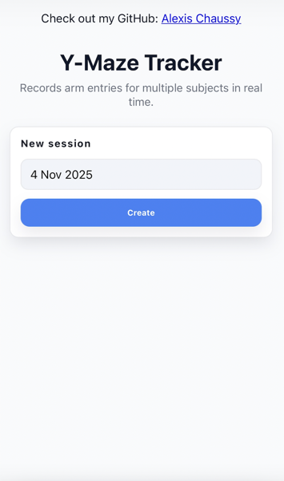
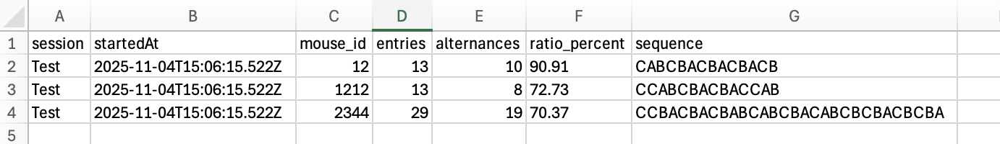

# Y‑Maze Tracker

Y‑Maze Tracker is a Progressive Web App (PWA) for recording Y‑maze arm entries (A, B, C) per subject, computing alternation metrics, running timed sessions, and exporting results for downstream analysis. Because it is a PWA, it can be installed like a native app or simply opened once and kept offline until browser data is cleared.

Live application / installable PWA: https://bacillex.github.io/Ymaze-tracker-pwa/

**Quick start:** Open the link above once on the tablet/phone or laptop you bring into the Y‑maze room while you still have connectivity. The app stores itself locally, so from then on you only need to reopen the same URL—even with no network—to run sessions and access past data.

## Overview
- **Who it’s for:** Labs and researchers that still log Y‑maze arm passages manually and don’t have automated tracking or reliable video capture.
- **What it provides:** A mobile-friendly interface to enter A/B/C choices, per-subject stats, an adjustable timer, and an Excel‑ready export.
- **Why it matters:** It replaces handwritten notes, speeds data collection during live trials, enforces consistent formatting, and reduces transcription errors while keeping everything available offline.

## Core Features
- Per-subject cards to add/remove subjects, append A/B/C entries, and undo the last input.
- Automatic metrics: total entries, number of correct alternations, alternation ratio.
- Session timer with modal alert when the countdown hits zero.
- Zoom controls plus responsive layout that works on phones, tablets, and desktops.
- Offline readiness (service worker + local storage) so sessions persist between visits.
- Excel-friendly CSV export (semicolon separator, `sep=;` hint, UTF‑8 BOM).

## Screenshots

## Workflow
1. Before the experiment day, visit the website once on the device you will use; this caches the app so you can simply reopen the same URL later even if the building Wi‑Fi is unavailable.
2. Enter a session name and press **Create**.
3. Add subject IDs, then use the A / B / C controls to record entries; **Undo** removes the most recent entry.
4. Start the session timer with **Play**. When it reaches zero, a modal appears and temporarily blocks the UI.
5. Use **Export** to download a CSV snapshot of the session.

## CSV Export Details
- Columns: `session`, `startedAt`, `mouse_id`, `entries`, `alternances`, `ratio_percent`, `sequence`.
- `sequence` concatenates the letters recorded for that subject.
- `alternances` counts every correct alternation (three successive, different arms).
- The alternation ratio is exported with three decimals:  
  `ratio_percent = (good_alternations / (total_entries - 2)) * 100`  
  (If `total_entries <= 2`, the ratio is defined as 0.)
- Output is Excel-friendly thanks to the semicolon separator, `sep=;` header, and UTF‑8 BOM. If Excel still shows a single column, import the file and specify semicolon as the delimiter.

## Usage Statistics
The app uses [GoatCounter](https://www.goatcounter.com/) for privacy-friendly analytics to monitor usage patterns. No personal data is collected. Public stats are available at https://ymaze-tracker-pwa.goatcounter.com

## Contributing
Contributions are welcome. Open issues or pull requests for bug fixes, UX improvements, additional stats, CSV tweaks, or multi-user ideas—the project is intentionally simple and community-driven.

## License
This project is distributed under the license found in the `LICENSE` file.
